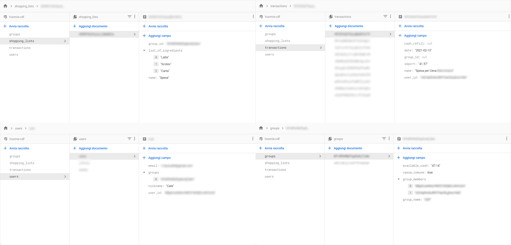
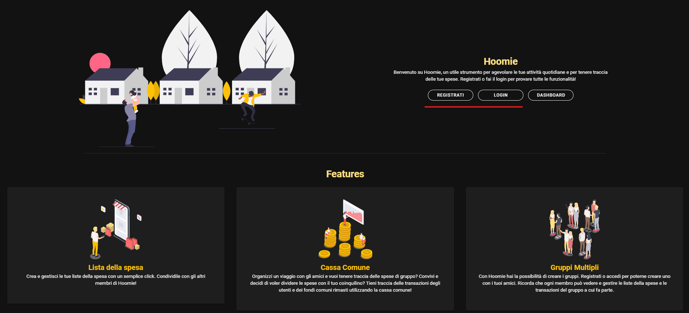
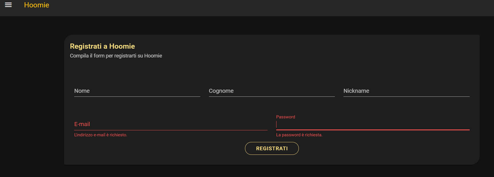

  

<!-- PROJECT SHIELDS -->
[![Hoomie][hoomie-shield]][hoomie-url]
[![Vue][vue-shield]][vue-url]
[![Vuetify][vuetify-shield]][vuetify-url]
[![LinkedIn][linkedin-shield]][linkedin-url]
[![FollowMe][follow-shield]][follow-url]
[![Stargazers][stars-shield]][stars-url]

<!-- PROJECT INTRODUCTION -->
# Introduction
## 1.1 General Infos
Hoomie is an application build with VueJs & VuetifyJs. It aims to track your personal and(/or) group expenses, and to give you useful tools for your daily tasks (such as creating and editing shopping lists, managing a petty cash with your friends and so on).  
This project is the completion of my first learning experience of the VueJs & VuetifyJs foundamentals, so it might be confused and not properly optimized (some routing problems may appear. Furthermore groups dashboard queries could be improved, collecting them in a single parent component).
## 1.2 Hosting & Database
I used Firebase Hosting to host the project, a NoSQL Firestore DB to manage my datas and Firebase Auth to manage users' authentication.

<!-- PROJECT OVERVIEW AND USER INSTRUCTION -->
# Instructions [T.B.D.]
## 2.1 Homepage & SignIn/LogIn
Once you open Hoomie you'll get to the homepage, which gives you some informations about the project and let you SignIn, Login or going to the dashboard. Click on the highlighted buttons to proceed with your registration or login.

If you are completely new, you have to register to the platform compiling the following form (if your username is already taken, an error will show up):

Otherwise, if you only want to login, please insert your credentials into the login form which is very similar to the previous one.
## 2.2 Personal Dashboard
### 2.2.1 Your Groups
### 2.2.2 Personal Informations
### 2.2.3 Personal Expenses
## 2.3 Group Dashboard
### 2.3.1 Group's members
### 2.3.2 Petty Cash
### 2.3.3 Group's Shopping Lists
### 2.3.4 Group's transactions

<!-- MARKDOWN LINKS & IMAGES -->
[hoomie-shield]: https://img.shields.io/badge/Hoomie-App-orange?logo=homeadvisor&style=plastic
[hoomie-url]: https://hoomie-cdf.web.app/
[vue-shield]: https://img.shields.io/badge/Vue-Js-green?logo=vue.js&style=plastic
[vue-url]: https://vuejs.org/
[vuetify-shield]: https://img.shields.io/badge/Vuetify-Js-teal?logo=vuetify&style=plastic
[vuetify-url]: https://vuetifyjs.com/en/
[follow-shield]: https://img.shields.io/github/followers/paolopertino?style=social
[follow-url]: https://github.com/paolopertino?tab=followers
[stars-shield]: https://img.shields.io/github/stars/paolopertino/Hoomie?style=social
[stars-url]: https://github.com/paolopertino/Hoomie/stargazers
[linkedin-shield]: https://img.shields.io/badge/Paolo-Pertino-blue?logo=linkedin&style=plastic
[linkedin-url]: https://www.linkedin.com/in/paolo-pertino/
